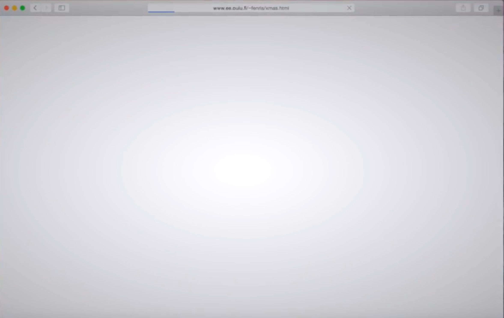
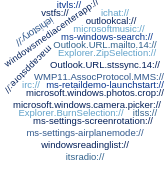
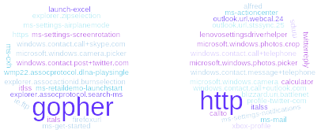
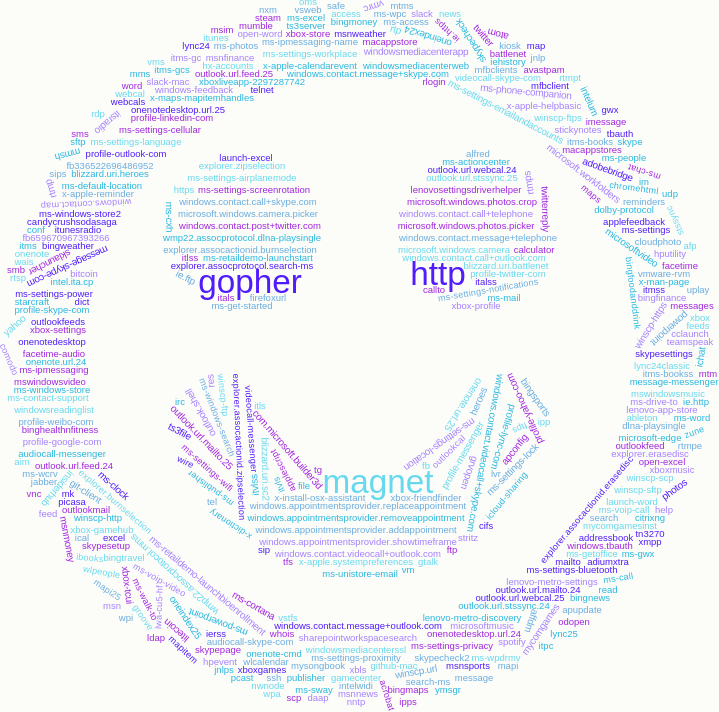
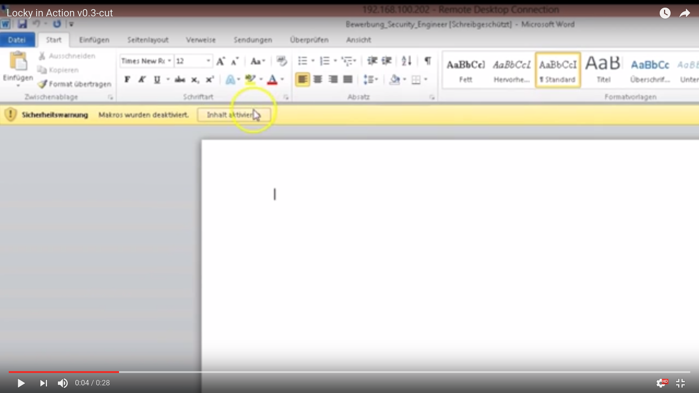
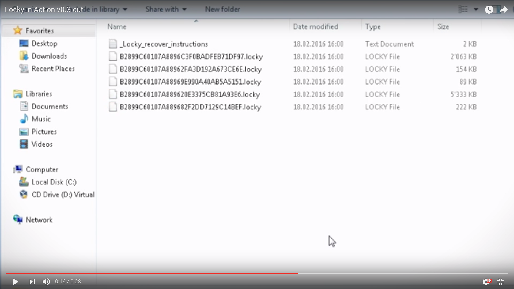
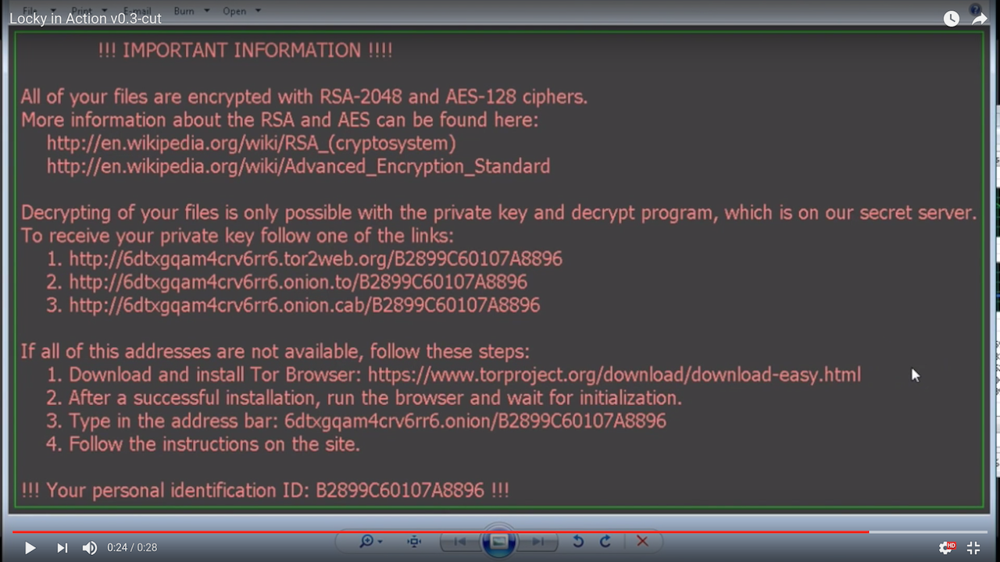

<!-- markdownlint-disable MD026 MD041 -->

.center[Warning: May Contain Traces of Serious Research]

---

class: center, middle

# Your privacy is protected

## ... by what exactly?

---

class: center, middle

# [video://](#xmas)

## You open a browser and visit a web page

---

name: xmas
class: center, middle

.myvideo[mov/xmas-0.4.mp4]

---

class: center, middle

# why://

## You don't want this to happen to your computer

---

class: center, middle

# who://

## Serious Researchers&#8482; - Aimo & Atte

---

class: center, bottom

### 1. You visit a web page

---

class: center, bottom

### 2. Flood of applications and content

---

class: center, bottom

### 3. Printers and cameras get involved

---

class: center, bottom

### 4. Hope not to misclick when recovering

---

class: center, middle

# They are _URL schemes_

---

class: center, middle

# <http://>

## <http://www.assembly.org/summer16/>

---

class: center, middle

# gopher://

## When I was young

---

class: center, middle

# magnet://

## Anyone?

---

class: center, middle

# [xxx://](#handlers)

## We found plenty

---

name: handlers
class: center, middle

---

class: center, middle

---

class: center, middle

---

class: center, middle

# Research&#8482;

## Very serious, please participate

---

class: center, middle

## (yellow | red | blue)

## We're yellow, beat us

---

class: center, middle

## (screenshot of steam/ingame)

---

class: center, middle

# [word://](#openword)

## Launch applications with remote content

---

name: openword
class: center, middle

.myvideo[mov/word-open-1.0.mp4]

---

class: center, middle

# So what?

## video://word-goes-wild

---

class: center, middle

.myvideo[mov/locky-0.3.mp4]

---

class: center, middle

# What happen?

## Quick recap

---

class: center, bottom

### Click link

---

class: center, bottom

### Load document

---

class: center, bottom

### Enable macros

---

class: center, bottom

### Files get crypted

---

class: center, bottom

### Time to buy bitcoins

---

class: center, middle

# danger://

---

class: center, middle

# [twitter://](#ads)

## so you wanted to adblock

---

name: ads
class: center, middle

.myvideo[mov/twitter-ad-0.2.mp4]

---

class: center, middle

# [freakshow://](#freakshow)

## Not just word:// or twitter://, they come in hundreds

---

name: freakshow
class: center, bottom

## fb://

---

class: center, bottom

## candycrush://

---

class: center, bottom

## bitcoin://

---

class: center, middle

# [challenge://?update](#challengeupdate)

## Who is winning? What have we found?

---

name: challengeupdate
class: center, bottom

<!-- markdownlint-disable MD034 -->

.myiframe[`https://ouspg.github.io/vecto-ctf/`]

<!-- markdownlint-enable MD034 -->

### Live until the end of the Assembly

---

class: center, middle

# [dontpanic://](#dontpanic)

## Grand Finale or just the Beginning?

---

name: dontpanic
class: center, middle

.myvideo[mov/panic-0.1.mp4]

---

class: center, middle

# [ask://](#ask)

## Meet and greet with mad and harmless scientists

---

name: ask
class: center, middle

Juhani "Aimo" Eronen (government "agent")

Kasper "Atte" Kyllönen (summer trainee in crime)

Mikko Kenttälä

Joachim Viide

Jani Kenttälä

Marko Laakso

Locky video edited from [Locky in Action by Omicron AG - Swiss made IT Security](https://youtu.be/GyZMJr7RfBE)

University of Oulu - OUSPG
