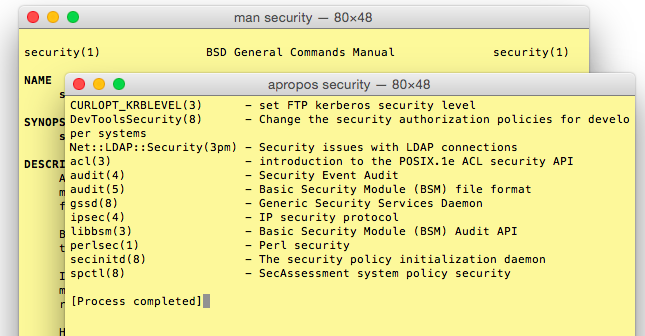
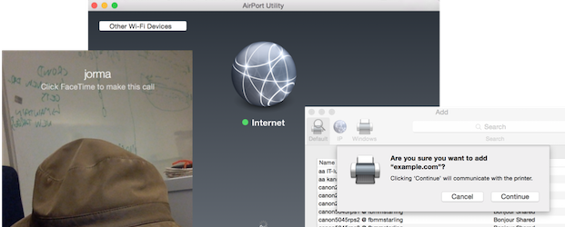
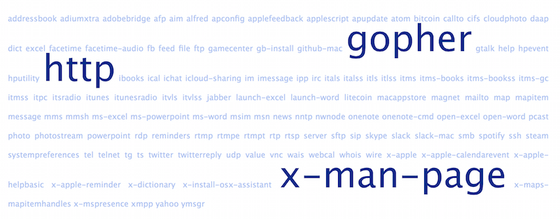
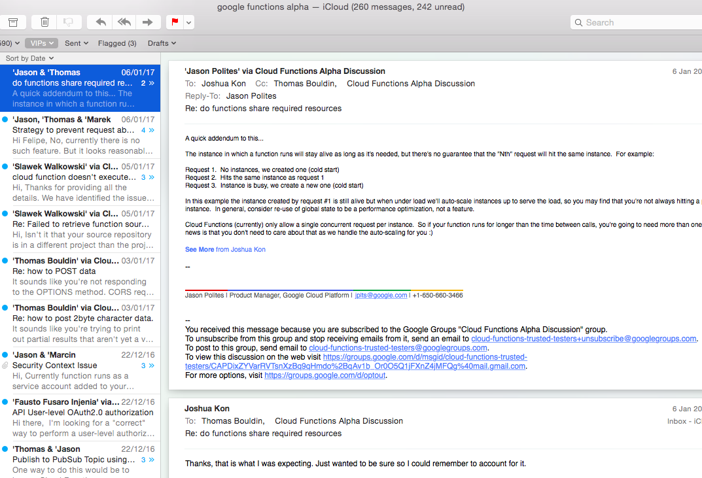

<!-- markdownlint-disable MD026 MD041 -->

.center[

# Making of [urlhandlers://](#start)

## Press space to proceed

## Or go directly to the [Project Repo](https://github.com/ouspg/urlhandlers)

]

---

name: start

## Autumn 2015 - Inspiration

* You might have noticed, @turmio [hacks terminals :)](http://www.crashterminal.org)
  * Learns to launch them automagically from the web
  * [x-man-page:///security](x-man-page:///security)
  * [x-man-page:///security;type=a](x-man-page:///security;type=a)
  * Asks aloud 'Is it safe?'

.right[]

---

## Spoils of the man pages

* We wrote [a DTrace script for `execve` on OSX](https://github.com/ouspg/urlhandlers/blob/master/osx/execve.d)

<!-- markdownlint-disable MD013 -->

```console
'login' '-pfq' 'nkapu' '/usr/bin/man' '-P' 'cat' '-k' 'security'
sh[33926] -> /usr/bin/apropos '/usr/bin/apropos' 'security'
sh[33927] -> /usr/bin/basename 'basename' '/usr/bin/apropos'
sh[33929] -> /usr/bin/man 'man' '--path'
sh[33930] -> /usr/bin/tr 'tr' ':' '\040'
sh[33933] -> /usr/bin/grep 'grep' '-i' 'security' '/usr/share/man/whatis'
sh[33934] -> /bin/cat 'cat'
sh[33935] -> /usr/bin/grep 'grep' '-i' 'security' '/usr/local/share/man/whatis'
```

<!-- markdownlint-enable MD013 -->

* We wrote [a vulnerability assessment](https://github.com/ouspg/urlhandlers/blob/master/cases/x-man-page.md)

* To us it appears to be .red[**safe by accident**]
  from shell meta-character injection ... for now ... with our skills!

---

## Winter 2015-2016 - Happy hobby hacking

* Temptation and occasional random hacking
* A bit of workshopping with [Kapsi Ry](https://www.kapsi.fi) activists
* A private Wiki for the collaboration
* We realized that there were
  * Plenty of URL handlers that launch **out of the browser behavior**
  * Even more handler specific query parameters
  * A bunch browsers (browsers, electron apps, chat clients, ...)
  * Many injection vectors (web, email, document, direct, **redirect**, ...)
  * -> Too many combinations to cover and behaviors to analyze

.right[]

---

## Logic of the denial

Some browsers whitelist autolaunch, blacklist deny, sometimes prompt
and sometimes don't when you try to active URL handlers. Safari used
to launch them all.

### Thumbs up for the paranoid browser

1. Browser -> Server: q?
1. Server -> Browser: Check this out, `img src="danger://"`
1. Browser: Yikes, **Thou shalt not pass!**

### ... we just wish it was smart as well!

1. Browser -> Server: q?
1. Server -> Browser: Check this out, `img src="http://bouncer/fuu"`
1. Browser -> Bouncer: q?
1. Bouncer -> Browser: You should redirect to `danger://`
1. Browser: **Ah ok, here goes!**

---

## Spring 2016 - a "project" & complexity explosion

* A public reposity @ <https://github.com/ouspg/urlhandlers/>
  * [preset URLs with query parameters](https://github.com/ouspg/urlhandlers/blob/master/web/db/handlerpresets.json)
  * [background links about URL schemes and prior vulnerabilities](https://github.com/ouspg/urlhandlers/blob/master/web/db/handlerurls.json)
  * [vulnerability assessment dissection of select URL handlers](https://github.com/ouspg/urlhandlers/tree/master/cases)
* Got a domain and **started** a web UI @ <http://hack.urlhandlers.info>
  * Like a real project, it is still WIP and doesn't do much yet :)
* Wrote tools to collect registered handlers on the OSX and Windows
  * Collected the results (handler, application, ...) in [a JSON in the repo](https://github.com/ouspg/urlhandlers/blob/master/web/db/handlerinfo.json)

.right[]

---

## Summer 2016 - 3 weeks of (real) (paid) work

* @nkapu hired for few weeks at the [OUSPG Open](https://github.com/ouspg/ouspg-open/),
  thanks to Google for sponsorship
* more tools, experiments and results into the repo
* focus on the awareness
  * documenting also as [videos](https://www.youtube.com/channel/UChoH-hBnBp_cS_awaOEtT_A)
  * preparing a [Assembly Summer 2016 ARTtech presentation](http://hack.urlhandlers.info/assembly/)

### Up next- State of the art at the beginning of the summer - [xmas://](#xmas)

```html
...
<iframe src="dict://Oulu"></iframe>
<iframe src="steam://installaddon/halflifehd"></iframe>
<iframe src="word:http://www.microsoft.com/investor/downloads/events/CreditSuisseReller.docx"></iframe>
<iframe src="applescript:"></iframe>
<iframe src="bitcoin:3JDs4hAZeKE7vER2YvmH4yTMDEfoA1trnC?amount=666&label=bitcoin&message=prevails"></iframe>
<iframe src="hpevent:"></iframe>
<iframe src="vnc:"></iframe>
<iframe src="macappstores://itunes.apple.com/app/id403961173?mt=12"></iframe>
...
```

---

name: xmas
class: center, middle

.myvideo[mov/xmas-1.1.mp4]

---

## Autumn 2016 - Party is over?

* Back to school
* "Just one more" presentation to some vulnerability researchers
* Apple fixes some problems, yay!
* Progress on understanding the implications 0.01/100

### Up next - State of the Art at the end of the summer - [panic://](#panic)

```html
...
<iframe src="applefeedback:"></iframe>
<iframe src="applefeedback:"></iframe>
<iframe src="applefeedback:"></iframe>
<iframe src="applefeedback:"></iframe>
<iframe src="applefeedback:"></iframe>
<iframe src="applefeedback:"></iframe>
<iframe src="applefeedback:"></iframe>
<iframe src="applefeedback:"></iframe>
<iframe src="applefeedback:"></iframe>
...
```

---

name: panic
class: center, middle

.myvideo[mov/panic-1.0.mp4]

---

## Winter 2016-2017 - Disobey!

* Here we are :)
* Progress 0.02/100, need help
  * Only 3 out of the hundreds handlers dissected
  * Only fraction of the browsers checked
  * Only simplest of the injection vectors scratched
  * Testing UI and bouncer backend very much work in progress
* But hey, instead of coding we managed to enroll to Google Cloud Functions
  (a bit like Amazon's lambda) alpha to use the latest tech.
  Just to find out that didn't have even time to read the emails. :)

.right[]

---

class: center, middle

## Thanks to Everyone!

### <https://github.com/ouspg/urlhandlers/>
