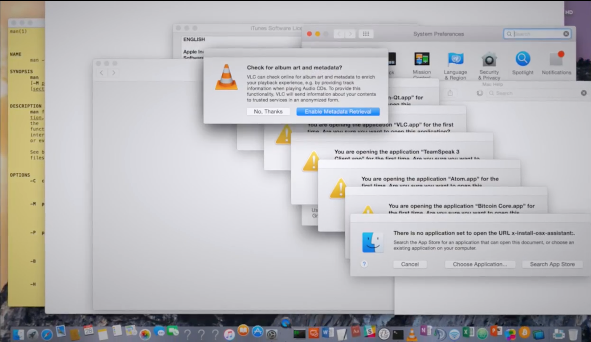
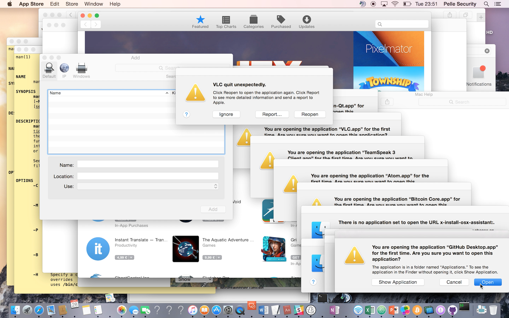
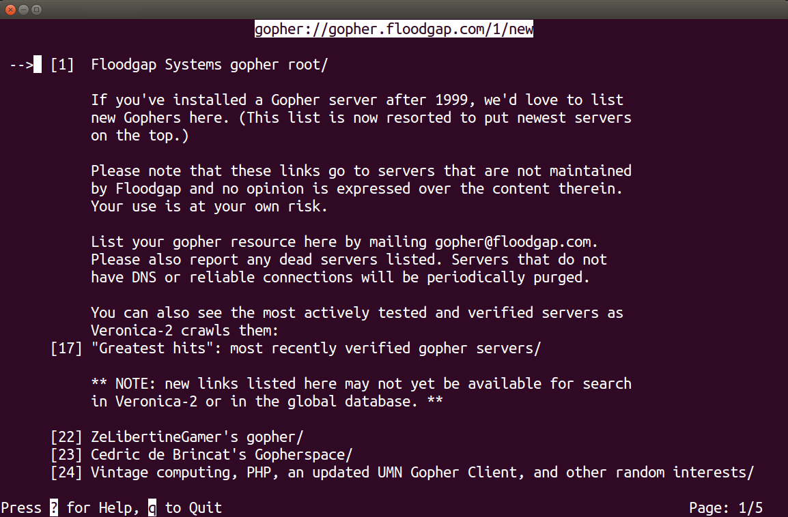
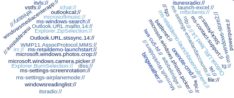
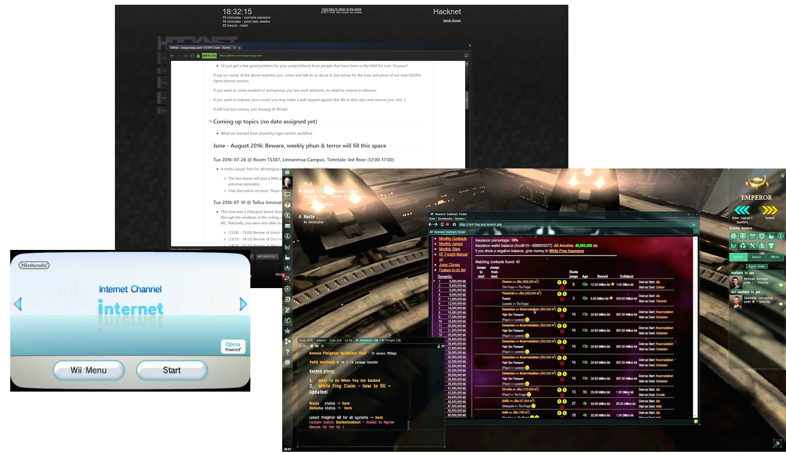
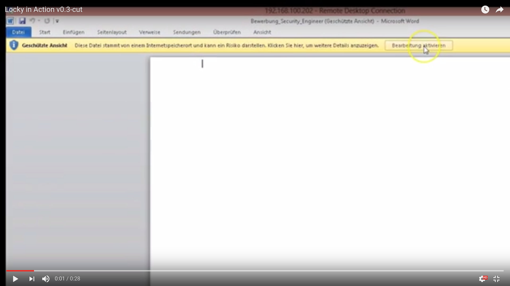
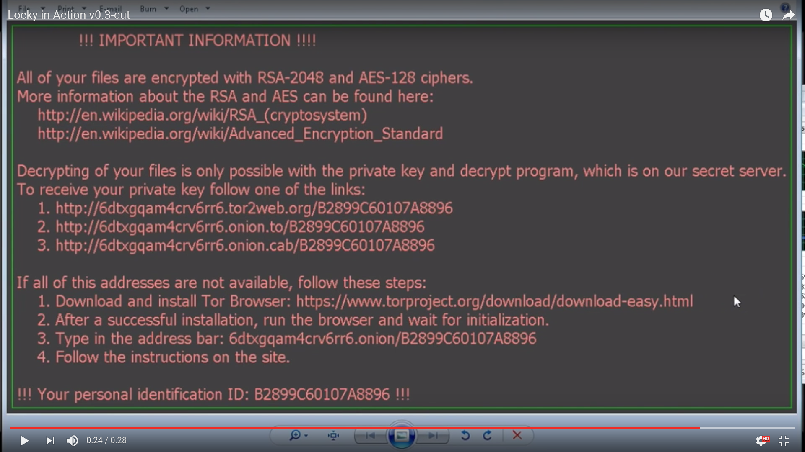
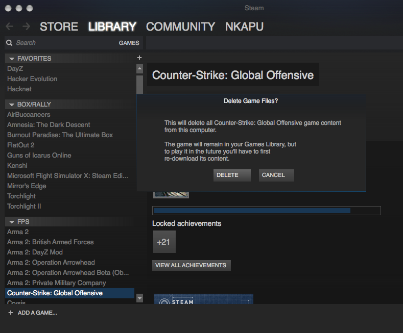
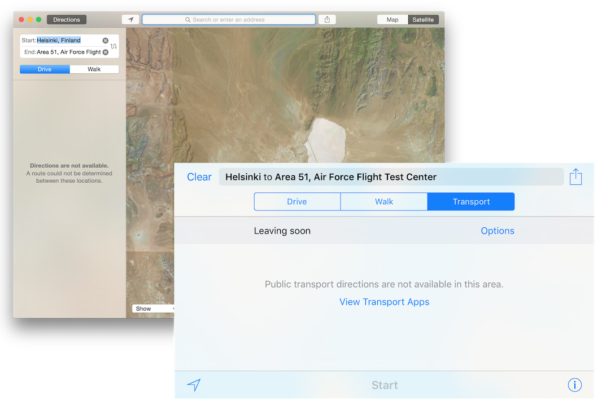

<!-- markdownlint-disable MD026 MD041 -->

.center[Warning: May Contain Traces of Serious Research]

---

class: center, middle

# Your privacy is protected

## ... by what exactly?

---

class: center, middle

# [video://](#xmas)

## You open a browser and visit a web page

---

name: xmas
class: center, middle

.myvideo[mov/xmas-1.0.mp4]

---

class: center, middle

# [why://](#who)

## You don't want this to happen to your computer

---

name: who
class: center, middle

# [who://](#xmasrecap)

## Serious Researchers&#8482; - Aimo & Atte

---

name: xmasrecap
class: center, bottom

### 1/4 You visit a web page

---

class: center, bottom

### 2/4 You are flooded by applications and content

---

class: center, bottom

### 3/4 Your printers and cameras get involved

---

class: center, bottom

### 4/4 You hope not to misclick while recovering

---

class: center, middle

# Meet the URL handlers

---

name: present
class: center, middle

# [http://](#past)

## <http://www.assembly.org/summer16/>

---

name: past
class: center, middle

# [gopher://](#past2)

## When I was young

---

name: past2
class: center, middle

## When I was young

---

name: future
class: center, middle

# [magnet://](#plenty)

## Anyone? Anything else?

---

name: plenty
class: center, middle

# [xxx://](#handlers)

## We found plenty

---

name: handlers
class: center, middle

---

class: center, middle

---

class: center, middle

---

class: center, middle

# Research&#8482;

## We need to find all the browsers. Very serious, please help!

---

class: center, bottom

## Plenty of browsers to launch the URLs - in and out of the game

---

class: center, bottom

## We're yellow, beat us. There is no shelter from the storm!

---

class: center, bottom

## Plenty of ways to spread the URLs, go go :)

---

class: center, middle

# [word://](#openword)

## Launch applications with remote content

---

name: openword
class: center, middle

.myvideo[mov/word-open-0.5.mp4]

---

class: center, middle

# So what?

## [video://word-goes-wild](#ransomware)

---

name: ransomware
class: center, middle

.myvideo[mov/locky-0.6.mp4]

---

class: center, middle

# What happen?

## Quick recap

---

class: center, bottom

### 1/4 You visit a web page and remote document loads

---

class: center, bottom

### 2/4 You enable macros

---

class: center, bottom

### 3/4 Your files get crypted

---

class: center, bottom

### 4/4 You buy bitcoins

---

class: center, middle

# [twitter://](#ads)

## so you wanted to adblock

---

name: ads
class: center, middle

.myvideo[mov/twitter-ad-1.0.mp4]

---

class: center, middle

# [freakshow://](#freakshow)

## Not just word:// or twitter://, they come in hundreds

---

name: freakshow
class: center, middle

# [candycrush://](#candycrush)

## [candycrushsodasaga://](candycrushsodasaga://)

---

name: candycrush
class: center, bottom

## Windows 10 is candy crushed out of the box

---

class: center, middle

# [bitcoin://](#bitcoin)

## [bitcoin://...?amount=666&label=Jorma&message=Donate](bitcoin:3JDs4hAZeKE7vER2YvmH4yTMDEfoA1trnC?amount=666&label=Jorma&message=Donate)

---

name: bitcoin
class: center, bottom

## Canned payments, just click `Send`

---

class: center, middle

# [steam://](#steam)

## [steam://uninstall/730](steam://uninstall/730)

---

name: steam
class: center, bottom

## csgo://gone

---

class: center, middle

# [maps://](#maps)

## [maps://?...daddr=Groom+Lake,+Nevada...](maps://?saddr=Helsinki&daddr=Groom+Lake,+Nevada&dirflg=r)

---

name: maps
class: center, bottom

## Your phone has them :)

---

class: center, middle

# [challenge://?update](#challengeupdate)

## Who is winning? What have we found?

---

name: challengeupdate
class: center, bottom

<!-- markdownlint-disable MD033 -->

<iframe src="http://go.urlhandlers.info/scores"></iframe>

<!-- markdownlint-enable MD033 -->

### Live until the end of the Assembly (requires a modern browser)

---

class: center, middle

# [dontpanic://](#dontpanic)

## Grand Finale or just the Beginning?

---

name: dontpanic
class: center, middle

.myvideo[mov/panic-1.0.mp4]

---

class: center, middle

# [ask://](#ask)

## Meet and greet with mad and harmless scientists

---

name: ask
class: center, middle

Juhani "Aimo" Eronen (government "agent")

Kasper "Atte" Kyllönen (summer trainee in crime)

Mikko Kenttälä

Joachim Viide

Jani Kenttälä

Marko Laakso

Locky video edited from [Locky in Action by Omicron AG - Swiss made IT Security](https://youtu.be/GyZMJr7RfBE)

University of Oulu - OUSPG
